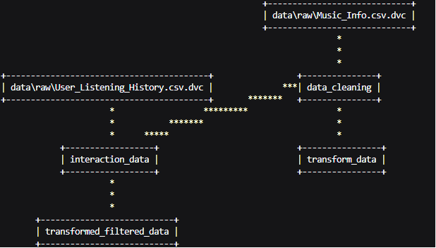

<p align="center">
  
  
  
  
  
  
  
  
</p>

<h1 align="center">🎵 Hybrid Music Recommendation System</h1>

<p align="center">
  <b>An end-to-end, production-grade music recommendation engine combining Content-Based Filtering, Collaborative Filtering, and a Hybrid Recommender — built on ~50K songs and ~9.7M user interaction records, containerized with Docker, and deployed via CI/CD to AWS ECR.</b>
</p>

<p align="center">
  <a href="#-architecture">Architecture</a> •
  <a href="#-features">Features</a> •
  <a href="#-tech-stack">Tech Stack</a> •
  <a href="#-project-structure">Project Structure</a> •
  <a href="#-dvc-pipeline">DVC Pipeline</a> •
  <a href="#-cicd-pipeline">CI/CD Pipeline</a> •
  <a href="#-docker">Docker</a> •
  <a href="#-getting-started">Getting Started</a> •
  <a href="#-roadmap">Roadmap</a>
</p>

---

## 🏗 Architecture

```
                              ┌───────────────────────┐
                              │     Streamlit UI      │
                              │   (app.py – cached)   │
                              └──────────┬────────────┘
                                         │
                      ┌──────────────────┼──────────────────┐
                      ▼                  ▼                  ▼
           ┌──────────────────┐ ┌──────────────────┐ ┌──────────────────┐
           │  Content-Based   │ │   Collaborative  │ │     Hybrid       │
           │    Filtering     │ │     Filtering    │ │   Recommender    │
           │ (NearestNeighbors│ │ Cosine Similarity│ │ (Weighted Sum of │
           │  + Cosine Metric)│ │ on Sparse Matrix)│ │  CBF + CF Scores)│
           └────────┬─────────┘ └───────┬──────────┘ └────────┬─────────┘
                    │                   │                     │
                    ▼                   ▼                     ▼
           ┌──────────────────┐ ┌──────────────────┐ ┌───────────────────────┐
           │ ColumnTransformer│ │  Dask DataFrame  │ │ Normalized CBF +      │
           │ • CountEncoder   │ │Chunked Processing│ │ CF similarity scores  │
           │ • OneHotEncoder  │ │  of 9.7M rows    │ │ with user-controlled  │
           │ • TF-IDF         │ │        │         │ │ diversity weight      │
           │ • StandardScaler │ │        ▼         │ └───────────────────────┘
           │ • MinMaxScaler   │ │Sparse Interaction│
           └────────┬─────────┘ │Matrix (CSR)      │
                    │           └──────────────────┘
                    ▼
           ┌──────────────────┐
           │  Transformed     │
           │  Sparse Matrix   │
           │  (.npz)          │
           └──────────────────┘

  ┌──────────────────────────────────────────────────────────────┐
  │                    CI/CD Pipeline                            │
  │  GitHub Actions → Test → Docker Build → Push to AWS ECR      │
  └──────────────────────────────────────────────────────────────┘
```


## ✨ Features

### Currently Implemented
- **Exploratory Data Analysis** — Deep analysis of the Spotify dataset with rich visualizations (distributions, correlations, feature exploration)
- **Content-Based Filtering** — Recommends songs based on audio features, artist, tags, and metadata using a K-Nearest Neighbors model with cosine distance
- **Collaborative Filtering** — Recommends songs based on user listening patterns using cosine similarity on a user-track interaction matrix
- **Hybrid Recommender System** — Combines content-based and collaborative filtering scores using a weighted sum approach with min-max normalized similarity scores
- **Cold-Start Handling** — Automatically Fallback to Content-Based Filtering for new songs with no interaction history
- **Diversity Slider** — Interactive UI slider (1–10) that lets users control the balance between content-based and collaborative filtering in the hybrid recommender — lower values favor content similarity, higher values favor collaborative (user behavior) similarity
- **Case-Insensitive Input** — Song and artist names are consistently normalized (stripped & lowercased) across all filtering methods, ensuring robust lookups regardless of input casing
- **Streamlit Web App** — Interactive UI with song & artist input, selectable filtering method (Content-Based / Collaborative / Hybrid), configurable number of recommendations (5/10/15/20), diversity control, and embedded Spotify audio previews
- **Efficient Caching** — `@st.cache_data` and `@st.cache_resource` decorators to eliminate redundant data loading across Streamlit reruns
- **Large-Scale Data Processing** — Dask-based chunked processing of the 9.7M-row `User_Listening_History.csv` (~575 MB) to handle memory constraints
- **Sparse Matrix Representations** — Interaction matrices and transformed feature matrices stored as `scipy.sparse` CSR matrices for memory-efficient computation
- **DVC Pipeline** — Reproducible, versioned **4-stage** ML pipeline with full dependency tracking
- **Remote DVC Storage** — DVC data tracked and stored on **AWS S3** for remote team collaboration
- **Data Version Control** — Raw datasets (`Music_Info.csv`, `User_Listening_History.csv`) tracked via `.dvc` files, with data git-ignored
- **Dockerization** — Fully containerized application using a Python 3.13.5 base image, exposing port 8000 for consistent deployment across environments
- **CI/CD Pipeline** — GitHub Actions workflow with a CI job (code checkout, dependency install, DVC pull, app launch, pytest) and a CD job (Docker build & push to AWS ECR)
- **Automated Testing** — Pytest-based smoke test (`tests/test_app.py`) that validates the Streamlit app loads successfully (HTTP 200)

---

## 🛠 Tech Stack

| Category | Technologies |
|----------|-------------|
| **Language** | Python 3.13.5 |
| **ML / Data Science** | scikit-learn, SciPy, NumPy, Pandas, category_encoders |
| **Large-Scale Processing** | Dask (parallel DataFrame operations for 9.7M rows) |
| **Feature Engineering** | TF-IDF Vectorizer, OneHotEncoder, CountEncoder, StandardScaler, MinMaxScaler |
| **Similarity / Model** | NearestNeighbors (brute-force cosine), Cosine Similarity |
| **Visualization** | Matplotlib, Seaborn (EDA notebooks) |
| **Web App** | Streamlit |
| **Pipeline & Versioning** | DVC (Data Version Control) with AWS S3 remote storage |
| **Containerization** | Docker (Python 3.13.5 base image) |
| **CI/CD** | GitHub Actions (CI: test suite, CD: Docker build → AWS ECR push) |
| **Cloud** | AWS (S3 for DVC storage, ECR for container registry) |
| **Testing** | Pytest, Requests |
| **Serialization** | Joblib (models & transformers), SciPy npz (sparse matrices), NumPy npy (arrays) |

---

## 📂 Project Structure

```
hybrid-recommender-system/
│
├── app.py                            # Streamlit application (caching, UI, recommendation display)
│
├── src/
│   ├── __init__.py
│   ├── data_cleaning.py              # Raw data cleaning → cleaned_music_data.csv
│   ├── content_based_filtering.py    # ColumnTransformer training, NearestNeighbors model
│   ├── collaborative_filtering.py    # Dask-based interaction matrix, cosine similarity CF
│   ├── hybrid_recommendation.py      # Hybrid recommender — weighted CBF + CF scores
│   └── transform_filtered_data.py    # Transforms filtered collaborative data for hybrid recommender
│
├── tests/
│   └── test_app.py                   # Smoke test — validates Streamlit app loads (HTTP 200)
│
├── .github/
│   └── workflows/
│       └── ci.yaml                   # CI/CD pipeline (GitHub Actions → AWS ECR)
│
├── notebook/
│   ├── EDA_Spotify_Dataset.ipynb             # Exploratory Data Analysis
│   ├── Spotify_Content_Based_Filtering.ipynb # CBF prototyping & experiments
│   └── Spotify_Collaborative_Filtering.ipynb # CF prototyping & experiments
│
├── data/
│   ├── raw/
│   │   ├── Music_Info.csv              # ~50K songs (14.9 MB) — DVC-tracked
│   │   ├── Music_Info.csv.dvc
│   │   ├── User_Listening_History.csv  # ~9.7M rows (575 MB) — DVC-tracked
│   │   └── User_Listening_History.csv.dvc
│   └── processed/
│       ├── cleaned_music_data.csv      # Cleaned song metadata (13.7 MB)
│       ├── transformed_data.npz        # Sparse feature matrix for CBF (4.5 MB)
│       ├── collab_filtered_data.csv    # Songs filtered to those in user history (8.3 MB)
│       ├── interaction_matrix.npz      # Sparse user-track interaction matrix (32.3 MB)
│       ├── track_ids.npy               # Ordered track ID array for CF (640 KB)
│       └── transformed_hybrid_data.npz # Sparse feature matrix for hybrid recommender (2.7 MB)
│
├── models/
│   └── nearest_neighbor_cbf.joblib     # Trained NearestNeighbors model (11.1 MB)
│
├── assets/
│   └── pipeline.png                    # DVC pipeline visualization
│
├── Dockerfile                          # Container definition (Python 3.13.5, port 8000)
├── transformer.joblib                  # Trained ColumnTransformer (135 KB)
├── dvc.yaml                            # DVC pipeline definition (4 stages)
├── dvc.lock                            # Locked pipeline state with hashes
├── .dvcignore                          # DVC ignore patterns
├── .gitignore                          # Git ignore (data, models, artifacts)
├── requirements.txt                    # Production Python dependencies
├── requirements-dev.txt                # Development Python dependencies (includes DVC, pytest, etc.)
└── README.md                           # ← You are here
```

---

## 🔄 DVC Pipeline

The ML pipeline is managed by DVC with **4 stages** and full dependency tracking:



Reproduce the entire pipeline with:
```bash
dvc repro
```

---

## 🔍 How It Works

### Content-Based Filtering

1. **Data Cleaning** — Deduplication by `spotify_id`, dropping irrelevant columns (`genre`, `spotify_id`), filling missing `tags`, lowercasing text fields
2. **Feature Engineering** — A `ColumnTransformer` applies five parallel transformations:
   - **Frequency Encoding** (`CountEncoder`) on `year`
   - **One-Hot Encoding** on `artist`, `time_signature`, `key`
   - **TF-IDF Vectorization** (`max_features=85`) on `tags`
   - **Standard Scaling** on `duration_ms`, `loudness`, `tempo`
   - **Min-Max Scaling** on `danceability`, `energy`, `speechiness`, `acousticness`, `instrumentalness`, `liveness`, `valence`
3. **Model Training** — A `NearestNeighbors` model with cosine distance (`algorithm='brute'`) is fitted on the sparse transformed matrix
4. **Recommendation** — Given a (song, artist) pair, the model finds the K+1 (which includes the current song) nearest neighbors and returns the top-K similar songs

### Collaborative Filtering

1. **Large-Scale Ingestion** — The 9.7M-row `User_Listening_History.csv` (~575 MB) is loaded using **Dask DataFrames** for memory-efficient, chunk-based parallel processing
2. **Interaction Matrix** — User-track interactions (play counts) are aggregated and stored as a `scipy.sparse.csr_matrix` for memory efficiency
3. **Recommendation** — Given a song, its interaction vector is compared against all other tracks using cosine similarity, and the top-K most similar tracks are returned

### Hybrid Recommender System

1. **Score Computation** — For a given (song, artist) pair, both content-based similarity scores (cosine similarity on the transformed feature matrix) and collaborative filtering similarity scores (cosine similarity on the interaction matrix) are computed independently
2. **Min-Max Normalization** — Both score vectors are normalized to [0, 1] range to ensure fair comparison regardless of their original scales
3. **Weighted Combination** — The final score is computed as: `hybrid_score = w_cbf × content_score + w_cf × collaborative_score`, where the weights are controlled by the user via the **Diversity Slider** in the UI
4. **Diversity Control** — The slider ranges from 1 (favor content similarity — songs with similar audio features) to 10 (favor collaborative similarity — songs that users with similar taste also listen to)
5. **Recommendation** — The top-K songs with the highest hybrid scores are returned, ordered by relevance

---

## 🚀 CI/CD Pipeline

The project uses **GitHub Actions** with a two-job workflow:

### CI (Continuous Integration)
1. **Code Checkout** — Pulls the latest code from the `master` branch
2. **Python Setup** — Configures Python 3.13.5 with pip caching
3. **Dependency Installation** — Installs all development dependencies from `requirements-dev.txt`
4. **AWS Credentials** — Configures AWS credentials (via GitHub Secrets) for DVC S3 access
5. **DVC Pull** — Pulls data and model artifacts from the remote S3 storage
6. **App Launch** — Starts the Streamlit app in the background on port 8000
7. **Test Execution** — Runs `pytest tests/test_app.py` to validate the app loads (HTTP 200)
8. **Cleanup** — Stops the Streamlit process

### CD (Continuous Deployment)
1. **DVC Pull** — Pulls the latest data artifacts from S3
2. **ECR Login** — Authenticates with AWS Elastic Container Registry
3. **Docker Build & Push** — Builds the Docker image and pushes it to AWS ECR with the `latest` tag

The CD job runs **only after CI passes**, ensuring only tested code is deployed.

---

## 🐳 Docker

The application is fully containerized for consistent deployment:

```dockerfile
FROM python:3.13.5
WORKDIR /app/
COPY requirements.txt .
RUN pip install --no-cache-dir -r requirements.txt
# Copies models, processed data, source code, and app entrypoint
EXPOSE 8000
CMD ["streamlit", "run", "app.py", "--server.port", "8000"]
```

### Run Locally with Docker

```bash
# Build the image
docker build -t hybrid-recommender .

# Run the container
docker run -p 8000:8000 hybrid-recommender
```

Then open `http://localhost:8000` in your browser.

---

## 🚀 Getting Started

### Prerequisites
- Python 3.10 or higher
- Git
- DVC

### Installation

```bash
# 1. Clone the repository
git clone https://github.com/ankitshri00132/Hybrid-Recommendation-System.git
cd Hybrid-Recommendation-System

# 2. Create and activate a virtual environment
python -m venv venv
# Windows
venv\Scripts\activate
# macOS/Linux
source venv/bin/activate

# 3. Install dependencies
pip install -r requirements.txt

# 4. Pull data with DVC (uses AWS S3 remote storage)
dvc pull

# 5. Reproduce the pipeline (optional — run if data/models are stale)
dvc repro

# 6. Launch the Streamlit app
streamlit run app.py
```

### Usage

1. Open the Streamlit app in your browser (default: `http://localhost:8501`)
2. Enter a **song name** and **artist name**
3. Select the filtering method: **Content-Based**, **Collaborative**, or **Hybrid Recommender System**
4. Choose how many recommendations you want (5 / 10 / 15 / 20)
5. Adjust the **Diversity Slider** (available for Collaborative & Hybrid modes) to control the recommendation balance
6. Click **Get Recommendation** — enjoy the results with embedded Spotify audio previews 🎧

> **Note:** If a song only exists in the content-based dataset (not in user listening history), only Content-Based Filtering will be available. Collaborative and Hybrid modes require the song to be present in the user interaction data.

---

## 📊 Datasets

| Dataset | Description | Size | Rows |
|---------|-------------|------|------|
| `Music_Info.csv` | Song metadata — name, artist, audio features, tags, Spotify preview URLs | 14.9 MB | ~50,000 |
| `User_Listening_History.csv` | User-track play counts | 575 MB | ~9,700,000 |

**Key Features in Music_Info:**
`track_id` · `name` · `artist` · `spotify_preview_url` · `tags` · `genre` · `year` · `duration_ms` · `danceability` · `energy` · `key` · `loudness` · `speechiness` · `acousticness` · `instrumentalness` · `liveness` · `valence` · `tempo` · `time_signature`

**User Listening History Columns:**
`user_id` · `track_id` · `playcount`

---

## 🗺 Roadmap

### Phase 1 — Classical ML ✅

- [x] Exploratory Data Analysis with visualizations
- [x] Data cleaning & preprocessing pipeline
- [x] Content-Based Filtering (NearestNeighbors + cosine distance)
- [x] Collaborative Filtering (cosine similarity on interaction matrix)
- [x] Hybrid Recommender (weighted sum of normalized CBF + CF scores)
- [x] Diversity Slider for user-controlled recommendation balance
- [x] Case-insensitive input handling across all filtering methods
- [x] Dask integration for large-scale user history processing
- [x] Streamlit UI with audio previews & caching
- [x] DVC pipeline with 4 reproducible stages
- [x] DVC data tracking with remote S3 storage
- [x] Dockerization (Python 3.13.5 container, port 8000)
- [x] CI/CD pipeline (GitHub Actions → pytest → Docker build → AWS ECR)
- [x] Automated smoke testing (pytest + requests)
- [x] Cold-Start problem handling


---

## 📐 Design Decisions

| Decision | Rationale |
|----------|-----------|
| **Dask over Pandas** for user history | The 9.7M-row dataset (~575 MB) exceeds comfortable in-memory processing; Dask enables chunked, parallel computation without loading everything into RAM |
| **Sparse matrices (CSR)** | Both the interaction matrix and transformed feature matrices are highly sparse; CSR format reduces memory from GBs to MBs |
| **NearestNeighbors with brute-force** | With ~50K songs, brute-force cosine search is fast enough and avoids approximation errors from tree-based methods |
| **ColumnTransformer pipeline** | Cleanly applies heterogeneous transformations (encoding, scaling, vectorization) in a single, reproducible step |
| **TF-IDF on tags** (`max_features=85`) | Captures the most informative tag terms while keeping dimensionality manageable |
| **Min-Max Normalization** for hybrid scores | Content-based and collaborative similarity scores operate on different scales; normalization ensures fair weighting |
| **User-controlled diversity weight** | Different users value content similarity vs. crowd wisdom differently; the slider empowers personalization without retraining |
| **Streamlit caching** | `@st.cache_data` for DataFrames/arrays, `@st.cache_resource` for the ML model — eliminates redundant I/O on every UI rerun |
| **DVC pipeline (4 stages)** | Ensures reproducibility and tracks data/model lineage; extended to S3 remote for team collaboration |
| **Separate `requirements-dev.txt`** | Keeps production dependencies lean while providing full tooling (DVC, pytest, etc.) for development and CI |
| **Docker containerization** | Ensures consistent runtime environment across dev, CI, and production; eliminates "works on my machine" issues |
| **CI/CD with GitHub Actions** | Automated testing gates prevent broken code from reaching production; CD pushes verified images to ECR for deployment |
| **Blue-Green Deployment** (planned) | Zero-downtime deployments on AWS ECS with instant rollback capability |

---

## 🧪 Testing

The project includes automated smoke tests to validate application health:

```bash
# Run tests locally (ensure the Streamlit app is running on port 8000)
streamlit run app.py --server.port 8000 &
python -m pytest tests/test_app.py -v
```


## 🧪 Notebooks

| Notebook | Purpose |
|----------|---------|
| `EDA_Spotify_Dataset.ipynb` | Comprehensive exploratory analysis — distributions, correlations, feature insights |
| `Spotify_Content_Based_Filtering.ipynb` | Prototyping & evaluating the content-based recommendation approach |
| `Spotify_Collaborative_Filtering.ipynb` | Prototyping & evaluating the collaborative filtering approach with Dask |

---
